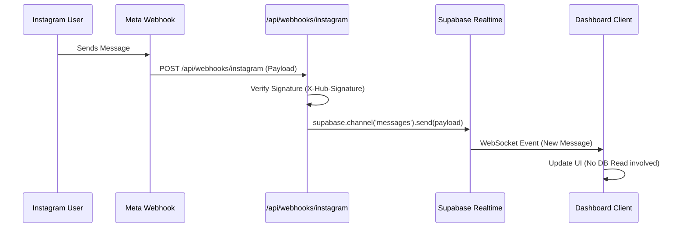

# Instagram Webhooks Guide (Development Mode)

Yes, you **can** use Webhooks without App Review, but **only for users with a role on your app** (Admin, Developer, Tester). This allows you to replace polling for your own account immediately while keeping the app in "Development Mode".

## 🚧 Constraints

1.  **Development Only**: Webhooks will NOT fire for regular public users until you pass App Review + switch to Live Mode.
2.  **HTTPS Required**: Meta requires a public HTTPS URL. For local development, you MUST use a tunnel like `ngrok` or `cloudflare-tunnel`.
3.  **"Published State" Warning**: The warning in the dashboard refers to public access. As an Admin, you can still receive webhooks in Development Mode.

## 🏗️ Proposed Architecture (No DB Storage)

To achieve true real-time updates without storing messages in the database, we can use **Supabase Realtime Broadcast**.



## 🛠️ Implementation Steps

### 1. Create the Webhook Endpoint
Create `app/api/webhooks/instagram/route.ts`:

```typescript
import { NextRequest, NextResponse } from 'next/server'
import crypto from 'crypto'

// 1. Verify Verification Request (GET)
export async function GET(req: NextRequest) {
  const searchParams = req.nextUrl.searchParams
  const mode = searchParams.get('hub.mode')
  const token = searchParams.get('hub.verify_token')
  const challenge = searchParams.get('hub.challenge')

  if (mode === 'subscribe' && token === process.env.META_WEBHOOK_VERIFY_TOKEN) {
    return new NextResponse(challenge)
  }
  return new NextResponse('Forbidden', { status: 403 })
}

// 2. Handle Event Notifications (POST)
export async function POST(req: NextRequest) {
  // verify signature...
  const body = await req.json()
  
  if (body.object === 'instagram') {
    for (const entry of body.entry) {
        // 1. Trigger Automation Engine (Instant Response)
        // await processAutomation(entry)

        // 2. Broadcast to client via Supabase Realtime
        // supabase.channel(`chat:${entry.id}`).send(...)
    }
  }
  
  return NextResponse.json({ received: true })
}
```

### 2. Configure Meta Dashboard
1.  Go to **Meta App Dashboard > Instagram > Webhooks**.
2.  Click **"Edit Subscription"**.
3.  **Callback URL**: Your public HTTPS URL (e.g., `https://your-project.vercel.app/api/webhooks/instagram`).
4.  **Verify Token**: A random string you create (match with `META_WEBHOOK_VERIFY_TOKEN` env var).
5.  **Subscribe to fields**: `messages`, `mentions`, `comments`.

### 3. Local Development (Tunneling)
Since Meta can't reach `localhost:3000`, use Ngrok:
```bash
ngrok http 3000
```
Use the `https://xxxx.ngrok-free.app/api/webhooks/instagram` URL in the Meta Dashboard.

## 
## ⚡ Automation & Performance Impact

Using Webhooks instead of Cron Jobs makes a **massive difference** for automation:

| Feature | Cron Polling (Current) | Webhooks (Event-Driven) |
| :--- | :--- | :--- |
| **Response Time** | Slow (up to 60s delay) | **Real-time (< 1s)** |
| **Efficiency** | Wasted checks when idle | **Zero waste** (runs only on events) |
| **Rate Limits** | Consumes API quota every minute | **Zero API calls** to fetch new data |
| **Scalability** | Gets slower as scale increases | Scales instantly with traffic |

**Recommendation:** For features like "Auto-Reply to Comments", Webhooks providing a <1s response time feels "magical" to users, whereas a 60s delay feels "broken".
