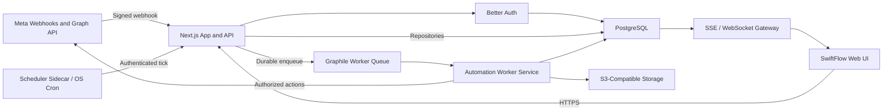

# SwiftFlow Automation-First Self-Hosted Transformation Roadmap

**Status:** Draft for approval
**Last updated:** 2026-07-26
**Target:** Stable self-hosted v1 with a premium-grade product experience
**Estimated duration:** 14-20 weeks with one focused implementer and a feature freeze
**Early milestones:** Automation-first beta in 3-5 weeks; premium experience beta in 7-10 weeks
**Canonical project name:** `Social-Media-Manager-AI-Tool` (product name: SwiftFlow)

## 1. Purpose

This roadmap turns SwiftFlow into an automation-first, self-hosted,
open-source product that:

- uses Instagram Login as the default Meta connection path;
- keeps Facebook Login as an optional advanced path;
- preserves Meta webhooks and every supported automation behavior;
- replaces Supabase with provider-neutral, self-hostable infrastructure;
- upgrades the complete product experience to a coherent, responsive,
  accessible, premium-grade interface;
- is deployable, diagnosable, backupable, and upgradeable by a technical
  self-hoster;
- reaches a stable release through staged migration rather than a big-bang
  rewrite.

This document is the implementation source of truth for the transformation.
Older Supabase self-hosting and production-readiness plans remain useful
references, but where they conflict with this roadmap, this roadmap controls.

## 2. Executive Decision

SwiftFlow will not replace Supabase with another all-in-one backend platform.
It will keep PostgreSQL and replace each Supabase capability with a focused,
provider-neutral component.

| Current capability | Target capability |
| --- | --- |
| Supabase Postgres | Vanilla PostgreSQL |
| Supabase query client | Server-side repositories using Drizzle, with `pg` for low-level transactions and advanced SQL |
| Supabase Auth | Better Auth backed by PostgreSQL |
| Supabase RLS identity helpers | Transaction-scoped application identity with PostgreSQL RLS |
| Supabase Storage | S3-compatible object storage |
| Supabase Realtime | Server-Sent Events, with WebSocket only where bidirectional realtime is required |
| Supabase Edge Functions | Long-running Node.js/TypeScript worker service |
| Supabase scheduler/functions invocation | Graphile Worker plus a single scheduler entry point |
| Supabase Studio | Optional PostgreSQL administration tooling, not part of the product runtime |

The Meta webhook boundary remains unchanged from Meta's perspective:

```text
Meta -> public HTTPS callback -> signature validation -> durable event insert
     -> worker queue -> automation execution -> Meta API action
```

Supabase is not part of the Meta webhook protocol. It currently provides
persistence and function invocation after delivery, and those are the pieces
being replaced.

## 3. Confirmed Product Decisions

### 3.1 Meta connection strategy

- **Default:** Instagram API with Instagram Login.
- **Optional advanced path:** Instagram/Facebook features through Facebook
  Login.
- The default path supports Instagram professional-account publishing,
  comments, private replies, messages, and webhooks.
- The advanced path is shown only when the operator wants Facebook Page
  publishing, Page comments/messages, or cross-platform functionality.
- Each self-hosted deployment uses its own Meta app credentials.
- Standard Access is intended for accounts owned or managed by the
  self-hoster and added to that Meta app.
- A deployment serving unrelated third-party businesses must follow Meta's
  Advanced Access, App Review, and business verification requirements.

### 3.2 Automation strategy

- Automations are the primary product surface.
- The current graph-based engine remains the business-logic foundation.
- New node types are not a priority until the runtime is deterministic,
  observable, recoverable, and policy-aware.
- Meta messaging rules are enforced at activation time and again at runtime.
- A comment-triggered private reply is limited to one message per comment and
  must remain inside Meta's allowed window.
- Follow-up automation requires a recipient response and an open messaging
  window.
- Automated use of the `human_agent` tag is prohibited.

### 3.3 Migration strategy

- No big-bang rewrite.
- No destructive database cutover until rollback has been rehearsed.
- The current application remains functional while provider-neutral
  boundaries are introduced.
- New components run beside Supabase first.
- Each capability is cut over only after contract and end-to-end tests pass.
- Supabase is removed last, not first.

### 3.4 Premium product experience

- Premium-grade UI is part of stable v1, not a post-release polish item.
- The visual system is rebuilt from shared tokens and accessible components
  before screens are migrated in route-sized batches.
- The highest-priority journeys are onboarding, Meta connection health,
  automation creation, node configuration, activation, testing, and run
  inspection.
- Functional behavior and automation contracts remain stable while the
  presentation layer changes.
- The experience must be responsive, keyboard-operable, understandable in
  loading/empty/error states, and visually consistent across all retained
  product areas.
- The redesign may simplify information architecture and interaction patterns,
  but may not silently remove a retained capability.

## 4. Current Baseline

The repository is strongly coupled to Supabase, but the core automation and
Meta business logic is reusable.

Measured on 2026-07-26:

| Area | Current baseline |
| --- | ---: |
| Supabase-coupled source files | 107 |
| `.from(...)` data-query calls | 474 |
| `.auth.*` calls | 111 |
| `.storage.*` calls | 8 |
| `.functions.invoke(...)` calls | 11 |
| Supabase Edge Function directories | 27 |
| SQL migration files | 18 |
| RLS/policy occurrences in migrations | 139 |
| PostgreSQL function occurrences | 10 |
| Dockerfile | Comparison worker image implemented; full app image pending |
| Compose file | PostgreSQL test and comparison-worker services implemented; full stack pending |
| `env.example` | Present and expanding during migration |
| OSS license file | Missing |

Existing verification commands:

```bash
npm run validate:env
npm run lint
npm run test:ci
npm run build
```

Known immediate automation risks:

1. `action_http_request` can perform unrestricted outbound fetches.
2. `follower_count` and `comment_count` condition placeholders currently
   evaluate as true.
3. Resolved in the transformation foundation: workflow runs, delayed
   continuations, and provider actions are pinned to append-only workflow
   version rows.
4. The webhook route performs more synchronous work before acknowledging
   Meta than the target architecture should allow.

## 5. Target Architecture



### 5.1 Runtime services

The minimum documented deployment consists of:

1. `app`: Next.js web application and public API.
2. `postgres`: application database and Graphile Worker queue.
3. `worker`: automation, AI, sync, publishing, and scheduled-job execution.
4. `storage`: S3-compatible object storage, either bundled or externally
   configured.
5. `scheduler`: one portable scheduler that triggers recurring work.
6. `reverse-proxy`: TLS termination and public routing when not provided by
   the host.

Redis is not required for stable v1 unless load testing proves PostgreSQL
queueing or session storage is insufficient.

### 5.2 Application boundaries

Production UI code must not talk directly to the database. The intended
request path is:

```text
client component -> Next.js route/server action -> domain service
                 -> repository -> PostgreSQL
```

Background work uses:

```text
route/domain service -> durable job -> worker handler -> repository/provider
```

Meta-specific behavior sits behind two adapters:

- `InstagramLoginMetaAdapter`
- `FacebookLoginMetaAdapter`

Both produce normalized accounts, permissions, inbound events, and outbound
actions for the automation engine.

## 6. Definition of Stable v1

Stable v1 is not reached merely when the app starts without Supabase. All of
the following gates must pass.

### 6.1 Product gates

- [ ] A new operator can deploy SwiftFlow using the documented Compose path.
- [ ] A first-run check clearly reports missing or invalid configuration.
- [ ] The operator can connect an Instagram professional account using
      Instagram Login.
- [ ] Facebook Login can be enabled as an optional advanced connection.
- [ ] The default automation templates can be created, activated, tested,
      paused, resumed, and inspected.
- [ ] The product clearly explains Meta account, permission, and messaging
      window requirements.

### 6.2 Premium experience gates

- [ ] A reviewed design direction, component system, and interaction language
      are applied across every primary product journey.
- [ ] Onboarding, dashboard, automations, run history, publishing, calendar,
      inbox, analytics, and settings no longer mix legacy and new visual
      patterns.
- [ ] Every primary screen has deliberate loading, empty, error, success,
      disabled, and permission-denied states where applicable.
- [ ] Primary journeys pass responsive review at phone, tablet, laptop, and
      large-desktop widths.
- [ ] Primary journeys pass automated accessibility checks and a manual
      keyboard/focus review against WCAG 2.2 AA expectations.
- [ ] Core Web Vitals and route bundle budgets pass on the agreed reference
      deployment and production-like fixture.
- [ ] Visual-regression coverage protects the design system and the highest
      value workflows.
- [ ] No visible control is dead, misleading, or backed by placeholder
      behavior.

### 6.3 Automation gates

- [ ] Signed Meta webhooks are acknowledged after durable enqueue, before
      expensive automation work.
- [ ] Replaying the same webhook cannot duplicate an external side effect.
- [ ] Worker restart during execution does not lose a queued run.
- [x] Delayed executions resume the workflow version that created them.
- [ ] Each run has a per-node timeline and a human-readable terminal state.
- [ ] Failed transient jobs retry with bounded exponential backoff.
- [ ] Terminal failures move to an inspectable dead-letter state.
- [ ] Repeated provider failures can automatically pause an automation.
- [ ] Comment/private-reply and DM policies are rejected before activation
      when the workflow is invalid.
- [ ] Comment-triggered delays are capped below Meta's private-reply limit in
      both UI and server validation.

### 6.4 Data and auth gates

- [ ] PostgreSQL schema, constraints, functions, and RLS policies are applied
      from versioned migrations.
- [ ] Every user-facing query is scoped to the active workspace.
- [ ] Better Auth preserves existing user IDs or provides a tested mapping.
- [ ] Existing password users can sign in without a forced reset, or the
      approved fallback migration is documented and tested.
- [ ] User sessions cannot obtain a database role that bypasses RLS.
- [ ] Database cutover is rehearsed against production-like data.
- [ ] Row counts and critical-table checksums are verified after restore.

### 6.5 Operations gates

- [ ] Backup and restore succeed on a fresh host.
- [ ] Upgrade and rollback instructions are tested.
- [ ] Secrets are not logged and can be rotated.
- [ ] Health checks cover the app, database, queue, workers, storage, scheduler,
      and Meta connection.
- [ ] Request/event/run IDs connect webhook logs to worker and provider logs.
- [ ] A seven-day minimum real-webhook soak completes without a P0/P1 issue.
- [ ] The release has no runtime dependency on Supabase packages, keys, URLs,
      hosted services, or Edge Functions.

## 7. Program Rules

1. Freeze unrelated feature development during the critical migration.
2. Preserve unrelated worktree changes; use a dedicated branch.
3. Add a regression test before changing a critical behavior.
4. Keep every database migration forward-compatible until its rollback gate
   passes.
5. Never dual-write to two databases without an explicit consistency and
   reconciliation design.
6. Prefer switching provider implementations behind stable interfaces.
7. Store provider IDs and object keys, not provider-specific public URLs,
   wherever possible.
8. Keep Meta access tokens and app secrets encrypted at rest.
9. Make all external side effects idempotent or protected by a durable
   side-effect ledger.
10. Do not expose incomplete nodes as successful behavior.
11. Do not enable the arbitrary HTTP Request node until egress controls pass
    security testing.
12. Do not remove the current production path until the replacement has a
    tested rollback.
13. Change presentation and business behavior in separate reviewable commits
    wherever practical.
14. Do not declare a screen redesigned until its responsive, accessibility,
    state, and visual-regression checks pass.

## 8. Delivery Timeline

The phases overlap where their dependencies allow it.

| Phase | Calendar target | Outcome |
| --- | --- | --- |
| 0. Program setup and freeze | Days 1-4 | Approved scope, branch, baselines, acceptance gates |
| 1. Safety and contract baseline | Week 1 | Unsafe/incomplete automation behavior disabled; contracts captured |
| 2. Provider-neutral runtime foundation | Weeks 1-2 | PostgreSQL, queue, worker, repositories, observability skeleton |
| 3. Automation vertical slice | Weeks 2-3 | Webhook-to-private-reply flow runs on the new worker |
| 4. Instagram Login and onboarding | Weeks 3-5 | Automation-first beta |
| 5. Premium UI and product experience | Weeks 3-10 | Design system and all primary journeys reach premium product beta |
| 6. Platform service migration | Weeks 5-8 | Storage, realtime, scheduler, remaining automation workers |
| 7. Data-access migration | Weeks 6-11 | Direct Supabase query use removed from production paths |
| 8. Auth and database cutover | Weeks 9-13 | Better Auth and vanilla PostgreSQL become primary |
| 9. Self-host packaging and OSS readiness | Weeks 11-15 | Repeatable deployment, backup, upgrade, docs, license |
| 10. Release candidate and soak | Weeks 15-20 | Stable self-hosted v1 |

Expected milestone ranges:

- **Automation-first beta:** 3-5 weeks.
- **Premium product experience beta:** 7-10 weeks.
- **Supabase-free release candidate:** 12-16 weeks.
- **Stable self-hosted v1:** 14-20 weeks.

A dedicated product designer/front-end implementer working in parallel can
reasonably compress the stable range toward 12-16 weeks. The plan should not
promise that range with only one focused implementer.

Part-time work, significant scope additions, delayed Meta test access, or
unexpected auth migration issues can extend these ranges.

## 9. Phase 0 - Program Setup and Feature Freeze

**Duration:** Days 1-4

### Objectives

- Establish one source of truth and measurable starting point.
- Prevent unrelated feature work from destabilizing the migration.
- Define what stays in stable v1.
- Define the premium visual direction and measurable experience standard.
- Protect the current production behavior with tests and backups.

### Deliverables

- [ ] Approve this roadmap.
- [ ] Create a dedicated `swiftflow-v2-transformation` branch.
- [ ] Record the current branch and unrelated worktree changes.
- [ ] Choose the authoritative package manager and lockfile.
- [ ] Define the stable-v1 feature matrix:
  - Instagram automations;
  - optional Facebook automations;
  - publishing and scheduling;
  - AI generation;
  - analytics;
  - team/workspace features;
  - Developer API/MCP;
  - hosted billing features.
- [ ] Inventory every route, shared component, responsive layout, state, and
      user-visible workflow that must enter the premium redesign.
- [ ] Approve the design brief: brand attributes, visual references,
      information density, typography, color, motion, and accessibility goals.
- [ ] Select the reference screens used to approve the design direction before
      broad implementation.
- [ ] Define supported browsers, viewport matrix, accessibility target, and
      route-level performance budgets.
- [ ] Decide the OSS license.
- [ ] Decide which SaaS-only features are disabled, optional, or removed.
- [ ] Produce a sanitized production-like database fixture.
- [ ] Create a pre-migration database backup and restore rehearsal.
- [ ] Capture current environment-variable inventory without secrets.
- [ ] Define initial service-level objectives for webhook acknowledgement,
      queue latency, worker completion, and provider failures.

### Exit gate

- [ ] Scope, branch, rollback owner, test accounts, and stable-v1 definition
      are approved.
- [ ] Existing unrelated changes are isolated.
- [ ] Build and test baseline is recorded.
- [ ] A database restore is proven before schema work begins.

### Rollback

No production behavior changes in this phase.

## 10. Phase 1 - Safety and Contract Baseline

**Duration:** Week 1

### Objectives

- Remove known unsafe or misleading automation behavior.
- Capture current behavior as provider-neutral contracts.
- Establish observability IDs before work moves across services.

### Deliverables

- [ ] Disable `follower_count` and `comment_count` conditions until they use
      real provider data.
- [ ] Disable `action_http_request` by default.
- [ ] Specify HTTP-action security requirements:
  - allow only `http` and `https`;
  - block loopback, link-local, private, and metadata destinations;
  - revalidate every redirect;
  - defend against DNS rebinding;
  - apply connection and total timeouts;
  - cap response size;
  - redact configured secret references;
  - allow an operator-managed domain allowlist.
- [ ] Add fixture-based tests for supported Instagram comment, message, story
      reply, and duplicate webhook payloads.
- [ ] Add contract tests for trigger matching and normalized automation events.
- [ ] Add stable request, webhook-event, automation-run, and provider-call IDs.
- [ ] Define a safe error taxonomy:
  - user configuration;
  - missing permission;
  - expired token;
  - provider rate limit;
  - provider transient;
  - policy rejection;
  - internal bug;
  - security denial.
- [ ] Add log-redaction tests for Meta tokens, app secrets, database URLs,
      auth cookies, and AI keys.

### Exit gate

- [ ] No exposed automation node silently succeeds with placeholder behavior.
- [ ] Critical webhook and automation behavior is represented by tests.
- [ ] One event can be traced through current logs using stable IDs.

### Rollback

Re-enable a disabled node only after the replacement behavior and tests ship.

## 11. Phase 2 - Provider-Neutral Runtime Foundation

**Duration:** Weeks 1-2

### Objectives

- Add the target infrastructure beside the current runtime.
- Introduce stable application boundaries without changing user behavior.

### Deliverables

- [ ] Add development Compose services for PostgreSQL and Graphile Worker.
- [ ] Add a versioned database-migration runner.
- [ ] Introduce provider-neutral interfaces for:
  - repositories;
  - auth identity;
  - object storage;
  - realtime events;
  - background jobs;
  - Meta accounts and tokens.
- [ ] Connect the new repository layer to the existing Supabase-managed
      PostgreSQL database first, using server-only credentials.
- [ ] Move browser-side direct data access behind authenticated Next.js APIs.
- [ ] Add `automation_events`, `automation_runs`, job, attempt, and
      side-effect ledger semantics required by the new worker.
- [x] Define immutable workflow versions and pin every run/delayed continuation
      to a version ID.
- [ ] Implement the durable inbox/outbox pattern:
  1. verify and normalize event;
  2. insert unique event;
  3. enqueue job in the same transaction;
  4. acknowledge webhook;
  5. execute side effects in a worker.
- [ ] Add queue retry, lease, stalled-job recovery, and dead-letter behavior.
- [ ] Add worker health and graceful shutdown behavior.

### Exit gate

- [ ] The new Postgres/worker stack starts locally from documented commands.
- [ ] Duplicate events produce one queued logical event.
- [ ] A worker can restart between dequeue and completion without losing work.
- [ ] The current production path remains selectable by configuration.

### Rollback

- Keep the new worker disabled by default.
- Revert the feature flag to the current Supabase orchestrator.
- Do not change the production database host in this phase.

## 12. Phase 3 - Automation Vertical Slice

**Duration:** Weeks 2-3

### Objective

Prove one real, high-value automation through the complete target runtime
before migrating the rest of the product.

### Selected slice

```text
Instagram comment webhook
-> signature verification
-> account/workspace resolution
-> idempotent event insert
-> trigger and keyword match
-> immutable run creation
-> private reply worker
-> Meta API result
-> per-node execution timeline
```

### Deliverables

- [ ] Port the comment trigger and private-reply worker to Node/TypeScript.
- [ ] Preserve current event-key and duplicate protections.
- [ ] Add a provider side-effect key before sending the Meta action.
- [ ] Record provider response IDs and safe error metadata.
- [ ] Add policy-aware activation checks for the selected flow.
- [x] Add an automation simulation mode using synthetic fixtures.
- [ ] Add per-node run status and retry visibility.
- [x] Add a reclaim test for a worker terminated mid-run.
- [x] Test duplicate Meta delivery and duplicate worker execution.
- [ ] Run the slice against a real Meta tester/admin account.

### Exit gate

- [ ] Three consecutive live executions succeed without manual database repair.
- [ ] Duplicate delivery cannot create a duplicate private reply.
- [x] A simulated worker crash is recovered automatically.
- [ ] Failure is visible and actionable from the SwiftFlow UI or operator logs.

### Rollback

- Route the selected trigger back to the existing Supabase orchestrator.
- Retain new event/run rows for diagnosis; do not delete them during rollback.

## 13. Phase 4 - Instagram Login and Onboarding

**Duration:** Weeks 3-5

### Objectives

- Make the lowest-friction Meta path the default.
- Make bring-your-own-Meta-app setup understandable and testable.

### Deliverables

- [ ] Introduce a normalized Meta connection model with an explicit
      `login_mode`.
- [ ] Implement the Instagram Login adapter using:
  - `graph.instagram.com`;
  - Instagram user access tokens;
  - `instagram_business_basic`;
  - `instagram_business_content_publish`;
  - `instagram_business_manage_comments`;
  - `instagram_business_manage_messages`.
- [ ] Preserve the existing Facebook Login adapter using its distinct tokens,
      hosts, account discovery, and permissions.
- [ ] Add separate OAuth routes/callback handling where required.
- [ ] Normalize inbound events from both login paths.
- [ ] Normalize outbound publishing, comment, private-reply, and message
      actions.
- [ ] Add the Quick Start onboarding flow:
  1. confirm professional Instagram account;
  2. enter or configure Meta app credentials;
  3. display exact redirect and webhook callback URLs;
  4. generate/verify webhook token;
  5. complete OAuth;
  6. subscribe webhook fields;
  7. send a test webhook/action;
  8. show health result.
- [ ] Add the optional Advanced Facebook path and its additional Page
      requirements.
- [ ] Add a Meta Account Health Center:
  - token state;
  - granted/required permissions;
  - webhook subscriptions;
  - last event;
  - last successful outbound action;
  - reconnection guidance.
- [ ] Add the compliant reply-keyword template:
      comment -> private reply asking for keyword -> inbound keyword message
      -> deliver requested content.
- [ ] Add UI and server policy warnings for 24-hour and 7-day windows.

### Automation-first beta gate

- [ ] A new self-hoster can follow the Quick Start guide without editing
      application source code.
- [ ] Instagram Login works without a linked Facebook Page.
- [ ] Comment, private-reply, inbound-message, and follow-up flows pass live
      tests.
- [ ] Facebook Login remains functional when explicitly selected.
- [ ] The original Supabase runtime is still available as rollback for
      non-migrated capabilities.

## 14. Phase 5 - Premium-Grade UI and Product Experience

**Duration:** Weeks 3-10

### Objectives

- Make SwiftFlow feel like a focused professional automation product rather
  than a collection of independently styled screens.
- Reduce the time and uncertainty required to connect Meta, build an
  automation, validate it, and understand a run.
- Establish a reusable visual and interaction system that can support future
  features without another broad redesign.
- Upgrade presentation without mixing UI rewrites with backend behavior
  changes.

### 14.1 Experience architecture and design system

- [ ] Capture a screenshot and interaction baseline for every retained route.
- [ ] Simplify information architecture, navigation groups, page hierarchy, and
      naming before visual implementation.
- [ ] Define semantic design tokens for color, typography, spacing, radius,
      elevation, borders, motion, and data visualization.
- [ ] Build accessible shared primitives and documented variants for forms,
      navigation, tables, cards, dialogs, drawers, command/search, feedback,
      skeletons, charts, and workflow controls.
- [ ] Define light/dark theme behavior only if both themes can meet the same
      contrast and visual-regression standard.
- [ ] Standardize iconography, product terminology, microcopy, and confirmation
      language.
- [ ] Create a local component showcase that covers normal, loading, empty,
      error, disabled, destructive, and permission-denied states.
- [ ] Add reduced-motion behavior and avoid decorative motion that delays work.

### 14.2 Priority journey redesign

Redesign and verify these journeys in order:

1. first-run setup, authentication, workspace creation, and Meta Quick Start;
2. Meta Account Health Center and reconnection;
3. dashboard and automation-first navigation;
4. automation templates, builder, node configuration, activation, and testing;
5. run history, per-node inspection, retry, pause, and failure recovery;
6. post composer, media generation, publishing, and content calendar;
7. comments, conversations, messages, and unified inbox;
8. analytics, brand profile, assistant, team, and settings surfaces;
9. Developer API/MCP and optional billing surfaces when retained.

For every journey:

- [ ] Remove duplicate, dead, misleading, or placeholder controls.
- [ ] Preserve the approved functional contract and permission boundaries.
- [ ] Add intentional loading, empty, error, success, offline/reconnect, and
      permission-denied states.
- [ ] Verify phone, tablet, laptop, and large-desktop layouts.
- [ ] Verify full keyboard operation, visible focus, labels, contrast, and
      screen-reader announcements for dynamic status.
- [ ] Use progressive disclosure for advanced Meta and self-host settings.
- [ ] Keep the primary action and current system state visually unambiguous.

### 14.3 Automation-builder premium standard

- [ ] Add a searchable, categorized node palette and task-oriented template
      gallery.
- [ ] Make connection validity, incomplete configuration, and unsupported
      combinations visible directly on the canvas.
- [ ] Use a consistent inspector panel for node configuration, help, examples,
      validation, and test results.
- [ ] Add an activation-readiness review that lists permissions, policy
      windows, missing values, and possible side effects.
- [ ] Make test mode clearly distinct from live mode and prevent accidental
      external sends.
- [ ] Add a readable execution timeline with node inputs, sanitized outputs,
      duration, retries, provider IDs, and terminal reason.
- [ ] Support keyboard selection, navigation, deletion, and undo/redo for core
      builder operations.
- [ ] Preserve useful canvas position and inspector state without hiding the
      saved-versus-published workflow version.

### 14.4 Quality and delivery system

- [ ] Approve three reference screens before migrating the full route set:
      onboarding, automation builder, and run inspector.
- [ ] Migrate route-sized batches behind reviewable feature flags or isolated
      commits.
- [ ] Add visual-regression tests for shared primitives and primary journeys.
- [ ] Add automated accessibility checks plus manual keyboard and screen-reader
      smoke tests.
- [ ] Define route bundle, image, animation, and Core Web Vitals budgets on the
      reference deployment.
- [ ] Test the redesigned onboarding and automation flow with at least five
      representative users; record completion time, confusion points, and
      failures.
- [ ] Keep an explicit legacy-to-new route checklist until no mixed visual
      surface remains.
- [ ] Do not add a new UI dependency unless it reduces net complexity and is
      compatible with self-hosting.

### Premium product beta gate

- [ ] The approved reference screens establish a coherent visual standard.
- [ ] All priority journeys use the shared design system.
- [ ] A new user can connect Meta and activate a safe starter automation without
      developer help.
- [ ] A user can identify why a run succeeded, paused, retried, or failed.
- [ ] Responsive, accessibility, performance, and visual-regression gates pass.
- [ ] No P0/P1 usability defect or legacy/new visual split remains in a primary
      journey.

### Rollback

- Release the redesign in route-sized batches.
- Keep compatibility tokens and legacy components only until each route batch
  passes its gate.
- Revert presentation independently from domain services when a redesign batch
  regresses functionality.

## 15. Phase 6 - Platform Service Migration

**Duration:** Weeks 5-8

### 15.1 Worker migration

- [ ] Group the 27 current Edge Functions by domain:
  - automation orchestration/workers;
  - scheduled publishing;
  - AI generation;
  - analytics/comments/messages sync;
  - assistant;
  - cleanup/retention;
  - legacy or duplicate functions.
- [ ] Port active functions into worker handlers with shared domain services.
- [ ] Remove duplicated Deno/Node implementations where one shared module can
      safely serve both during transition.
- [ ] Preserve internal authorization until each Edge Function is retired.
- [ ] Add job-level concurrency and provider-rate controls.

### 15.2 Scheduler

- [ ] Keep one scheduler entry point.
- [ ] Replace overlapping scheduler mechanisms with Graphile Worker recurring
      jobs or one authenticated scheduler sidecar.
- [ ] Prove overlapping ticks cannot duplicate scheduled posts or automation
      runs.
- [ ] Remove the legacy scheduler only after one full schedule cycle passes.

### 15.3 Storage

- [ ] Introduce a storage-provider interface.
- [ ] Store provider-neutral object keys and metadata.
- [ ] Configure S3-compatible local and external backends.
- [ ] Copy existing objects with checksums.
- [ ] Preserve or redirect old public URLs during the compatibility window.
- [ ] Verify upload, generated image, carousel, brand asset, and cleanup flows.

### 15.4 Realtime

- [ ] Replace the small Supabase Realtime surface with SSE for server-to-client
      message and run updates.
- [ ] Use authenticated workspace-scoped channels.
- [ ] Add reconnect and missed-event reconciliation.
- [ ] Add WebSocket only if a confirmed bidirectional use case requires it.

### Exit gate

- [ ] Active background work no longer depends on Supabase Edge Functions.
- [ ] Scheduled work survives app/worker restarts.
- [ ] Storage copy verifies successfully.
- [ ] Realtime reconnect cannot leak cross-workspace events.

### Rollback

- Keep original object storage read access during the compatibility window.
- Keep legacy workers deployable until replacement job counts and side effects
  reconcile.

## 16. Phase 7 - Data-Access Migration

**Duration:** Weeks 6-11

### Objectives

- Remove direct Supabase data access without changing the database host first.
- Make the later PostgreSQL host cutover a configuration and migration event.

### Sequence

1. Introduce repositories against the existing PostgreSQL database.
2. Move server components and actions to domain services/repositories.
3. Move client components to authenticated APIs/SWR.
4. Replace Supabase RPC calls with versioned SQL functions or repository
   transactions.
5. Remove service-role use from user-facing paths.
6. Only after behavior is stable, point repositories at vanilla PostgreSQL.

### Migration batches

- [ ] Workspace, membership, and settings.
- [ ] Social accounts and encrypted provider credentials.
- [ ] Automations, workflow versions, events, and runs.
- [ ] Posts, schedules, publishing automation, and media metadata.
- [ ] Comments, conversations, and messages.
- [ ] Analytics and content intelligence.
- [ ] Brand assets and generated media.
- [ ] Developer API/MCP state.
- [ ] Billing/entitlements if retained.
- [ ] Retention and audit data.

### Exit gate

- [ ] No production client component uses Supabase directly.
- [ ] All user-facing database paths use authenticated workspace-scoped
      services.
- [ ] Repository contract tests cover permission and not-found behavior.
- [ ] The current app passes against both the existing and vanilla PostgreSQL
      connections in CI or a migration test environment.

### Rollback

- Repository implementations remain switchable until the final cutover.
- Avoid schema changes that make the old runtime unreadable before the rollback
  window closes.

## 17. Phase 8 - Auth and Database Cutover

**Duration:** Weeks 9-13

### 17.1 Authentication

- [ ] Add Better Auth to PostgreSQL under an isolated schema.
- [ ] Preserve existing user UUIDs wherever possible.
- [ ] Export Supabase users, identities, verification state, and password
      hashes.
- [ ] Implement and test bcrypt verification compatibility for migrated
      password accounts.
- [ ] Rehash with the new preferred algorithm after a successful login if
      appropriate.
- [ ] Map OAuth identities without silently linking unverified accounts.
- [ ] Migrate password reset, verification, invitation, and session flows.
- [ ] Test forced session invalidation and secret rotation.
- [ ] Keep a documented reset fallback for accounts that cannot be migrated.

### 17.2 RLS identity compatibility

- [ ] Replace or compatibly implement `auth.uid()` and other Supabase-specific
      claim helpers.
- [ ] Set authenticated identity using transaction-local settings.
- [ ] Ensure pooled connections cannot retain another request's identity.
- [ ] Run RLS tests for every workspace-scoped table and mutation class.
- [ ] Verify application roles cannot use `BYPASSRLS`.
- [ ] Review security-definer functions and explicit `search_path` settings.

### 17.3 Database cutover

Preferred cutover:

1. Put mutation paths into maintenance/read-only mode.
2. Stop workers and scheduler.
3. Take final `pg_dump` plus object-storage manifest.
4. Restore into vanilla PostgreSQL.
5. Apply target migrations.
6. Verify extensions, row counts, constraints, functions, RLS policies, and
   critical-table checksums.
7. Start app and workers against the target database.
8. Run smoke tests.
9. Re-enable inbound mutations and scheduler.
10. Retain the source database unchanged through the rollback window.

### Exit gate

- [ ] Existing and new users can authenticate.
- [ ] Workspace isolation tests pass.
- [ ] A production-like dump/restore completes within the approved maintenance
      window.
- [ ] Critical data reconciliation reports no unexplained difference.
- [ ] The application runs with Supabase Auth and PostgREST disabled.

### Rollback

- Stop writes to the target.
- Point application and workers back at the preserved source database/auth.
- Reconcile any target-only writes before retrying.
- Do not destroy the source until the stable-release retention window passes.

## 18. Phase 9 - Self-Host Packaging and OSS Readiness

**Duration:** Weeks 11-15

### Deliverables

- [ ] Add a production multi-stage Dockerfile.
- [ ] Add a top-level Compose deployment.
- [ ] Add `.env.example` with generated-secret instructions.
- [ ] Add startup configuration validation.
- [ ] Add database migration and first-admin bootstrap commands.
- [ ] Add health checks and restart policies.
- [ ] Add persistent-volume documentation.
- [ ] Add backup, restore, upgrade, rollback, and disaster-recovery guides.
- [ ] Add a one-command diagnostic bundle that redacts secrets.
- [ ] Add deployment guides for a plain VPS and at least one supported
      self-host platform.
- [ ] Add the approved OSS license and update proprietary README language.
- [ ] Document optional versus required services.
- [ ] Document CPU, memory, storage, and public HTTPS requirements from
      measured usage.
- [ ] Document Meta Quick Start and Advanced Facebook setup.
- [ ] Document data retention and removal behavior.
- [ ] Add release versioning and migration compatibility policy.

### Exit gate

- [ ] A clean machine can reach a working login from documented commands.
- [ ] Backup from one installation restores into a fresh installation.
- [ ] An upgrade rehearsal succeeds and rollback restores the previous version.
- [ ] No documentation step depends on an unpublished local file or secret.

## 19. Phase 10 - Release Candidate, Soak, and Stable v1

**Duration:** Weeks 15-20

### Verification matrix

- [ ] Unit tests for domain logic and policy validation.
- [ ] Repository integration tests against PostgreSQL.
- [ ] Auth/RLS cross-workspace denial tests.
- [ ] Meta webhook fixture and signature tests.
- [ ] Duplicate/replay and side-effect idempotency tests.
- [ ] Worker crash, lease expiry, retry, and dead-letter tests.
- [ ] Storage copy and checksum tests.
- [ ] SSE reconnect and missed-event tests.
- [ ] Backup/restore and upgrade/rollback tests.
- [ ] Load tests for webhook bursts, queue depth, scheduled ticks, AI calls,
      media upload, and dashboard reads.
- [ ] Abuse tests for authentication, HTTP action, webhook body size, upload
      size, and expensive automation loops.
- [ ] Build, lint, and test commands pass from a clean checkout.
- [ ] Visual-regression suites pass at the agreed phone, tablet, laptop, and
      large-desktop viewports.
- [ ] Automated accessibility checks and manual keyboard/screen-reader smoke
      tests pass for every primary journey.
- [ ] Usability acceptance confirms first-run and automation tasks can complete
      without developer assistance.
- [ ] Route performance and Core Web Vitals budgets pass on the reference
      deployment.

### Live flow matrix

- [ ] Instagram comment -> public reply.
- [ ] Instagram comment -> private reply.
- [ ] Private reply -> user keyword response -> follow-up content.
- [ ] Instagram inbound message -> keyword automation.
- [ ] Supported story reply/mention behavior.
- [ ] Scheduled post.
- [ ] AI publishing automation creates a draft and media.
- [ ] Optional Facebook Page publishing/comment/message flows.
- [ ] Token expiration and reconnection.
- [ ] Provider rate limit and recovery.

### Stable release gate

- [ ] Seven continuous days of representative webhook traffic.
- [ ] No unresolved critical or high security finding.
- [ ] No unexplained duplicate external side effect.
- [ ] No lost acknowledged webhook in the test/soak environment.
- [ ] No cross-workspace data/event exposure.
- [ ] Backup, restore, upgrade, and rollback evidence is recorded.
- [ ] Operator runbooks cover every expected alert.
- [ ] Supabase runtime dependencies are removed.
- [ ] Every primary journey uses the approved design system and all blocking
      premium-experience defects are closed.
- [ ] Release notes document migration and known limitations.

## 20. Cross-Cutting Automation Requirements

### 20.1 Immutable versions

- Editing an automation creates a draft version.
- Activating publishes an immutable version.
- New events use the active version.
- Existing runs and delayed continuations retain their original version.
- Rollback activates a prior version; it does not mutate history.

### 20.2 Idempotency and side effects

- Event uniqueness includes provider, account, workspace, and provider event ID
  where available.
- Every external send/publish operation gets a stable side-effect key.
- A worker checks and atomically claims the side effect before calling Meta.
- Provider response IDs are saved for reconciliation.
- Ambiguous timeouts are reconciled before retrying where the provider supports
  lookup.

### 20.3 Runtime limits

Each automation or deployment can enforce:

- maximum nodes per run;
- maximum execution duration;
- maximum concurrent runs;
- maximum messages, emails, HTTP actions, AI calls, and generated media;
- maximum retry attempts;
- per-account Meta rate limits;
- automatic pause thresholds.

### 20.4 Activation compiler

Activation must fail when:

- the graph is cyclic or structurally invalid;
- nodes are unreachable or unsupported;
- required provider permissions are missing;
- a private reply lacks comment context;
- a delay crosses a Meta policy window;
- multiple disallowed private replies can occur for one comment;
- an HTTP action violates operator egress policy;
- no bounded fallback exists for a configured AI action where one is required;
- the projected maximum runtime/cost exceeds configured limits.

## 21. Security Requirements

- Verify Meta `X-Hub-Signature-256` against bounded raw bytes.
- Keep the GET verification token separate from the Meta app secret.
- Encrypt Meta tokens, Meta app secrets, AI keys, SMTP credentials, and other
  workspace secrets at rest.
- Support master-key rotation with versioned ciphertext.
- Never put privileged database credentials in the browser.
- Enforce workspace authorization in application services and PostgreSQL RLS.
- Use transaction-local request identity and clear it on transaction end.
- Apply rate limits to login, webhook, API key, message send, AI, upload, and
  automation activation paths.
- Make critical rate limiting fail closed.
- Use explicit internal service authentication for worker/admin endpoints.
- Redact headers, cookies, tokens, URLs with credentials, and provider payload
  secrets from logs.
- Add dependency, secret, container, and migration scanning to CI.
- Keep the HTTP Request node disabled until SSRF controls pass adversarial
  tests.

## 22. Observability and Operator Experience

Every automation execution should be traceable by:

- request ID;
- webhook event ID;
- workspace and social account ID;
- automation and workflow version ID;
- run and node-attempt ID;
- job ID;
- provider call ID;
- safe error code;
- latency and retry count.

The operator dashboard should report:

- app/database/worker/storage/scheduler health;
- current queue depth and oldest queued job;
- failed/dead-letter jobs;
- webhook delivery age by account;
- Meta token and permission health;
- automation success/failure rates;
- circuit-breaker and auto-pause events;
- backup freshness;
- running application and schema versions.

## 23. Risk Register

| Risk | Probability | Impact | Mitigation | Gate |
| --- | --- | --- | --- | --- |
| Auth migration breaks login or user IDs | Medium | Critical | Import rehearsal, bcrypt compatibility, mapping tests, reset fallback | Phase 8 |
| RLS identity leaks across pooled connections | Medium | Critical | Transaction-local identity, unprivileged roles, concurrency tests | Phase 8 |
| Duplicate Meta sends during retry | Medium | Critical | Durable event and side-effect ledgers, replay tests | Phases 2-3 |
| Instagram Login payload/token differences | Medium | High | Separate adapter and live tester-account contract tests | Phase 4 |
| Existing storage URLs break | Medium | High | Provider-neutral keys, compatibility reads/redirects, manifest | Phase 6 |
| Worker crash loses acknowledged event | Low after design | Critical | Transactional enqueue, leases, reclaim tests | Phases 2-3 |
| HTTP node reaches internal infrastructure | High currently | Critical | Disable, then add strict egress controls | Phase 1 |
| Placeholder condition triggers unintended action | High when used | High | Disable until implemented | Phase 1 |
| Scope growth extends timeline | High | High | Feature freeze and stable-v1 matrix | Phase 0 |
| Meta setup is too difficult | Medium | High | Quick Start wizard, health checks, exact copyable values | Phase 4 |
| Self-host upgrade damages data | Medium | Critical | Backups, migration preflight, upgrade/rollback rehearsal | Phase 9 |
| Dirty worktree causes accidental overwrite | Medium | High | Dedicated branch and file ownership discipline | Phase 0 |
| UI redesign creates regressions or a mixed old/new product | Medium | High | Reference-screen approval, route batches, contract and visual-regression tests | Phase 5 |

## 24. Remaining Product Decisions

These decisions must be made in Phase 0 and should not be silently assumed:

1. Which OSS license will SwiftFlow use?
2. Is Stripe billing removed, disabled by default, or retained as an optional
   hosted module?
3. Is the Developer API/MCP part of stable v1 or a later optional module?
4. Are multi-workspace teams included in stable v1?
5. Which deployment target is the primary documented path:
   plain Docker Compose, Coolify, Dokploy, or another platform?
6. Which object storage is bundled by default, if any?
7. What is the initial supported upgrade window and migration policy?
8. What capacity should the stable-v1 SLOs target?
9. Which visual direction and brand attributes define "premium" for SwiftFlow,
   and which reference products are acceptable inspiration?
10. Does stable v1 support both light and dark themes, or one fully polished
    theme first?
11. Which browser versions and minimum viewport widths form the support
    matrix?

## 25. Roadmap Tracking

Track each phase with:

- status: `not_started`, `in_progress`, `blocked`, `verification`, `complete`;
- owner;
- branch/commit;
- start and completion date;
- tests added;
- deployment or migration evidence;
- rollback evidence;
- unresolved risks;
- Vault memory/handoff IDs.

A phase is complete only when its exit gate passes. Code merged without the
required verification evidence remains in `verification`, not `complete`.

## 26. First Implementation Slice

After roadmap approval, begin with this bounded sequence:

1. Create the dedicated transformation branch.
2. Record build/test and current live automation baselines.
3. Add webhook fixtures and duplicate-delivery tests. Completed 2026-07-26.
4. Disable the placeholder count conditions and unrestricted HTTP action. Completed 2026-07-26.
5. Scaffold PostgreSQL and Graphile Worker beside the current stack. The clean-room
   PostgreSQL harness is implemented; Graphile Worker remains pending for the
   broader automation-job migration.
6. Implement the durable webhook inbox and worker lease/retry model. Inbox
   contract, direct PostgreSQL repository, bounded worker loop, lease ownership,
   retry/dead-letter transitions, crash tests, a dedicated process, and the real
   PostgreSQL integration suite were completed 2026-07-26. The isolated worker
   image, restartable compose service, database healthcheck, NOLOGIN capability
   role, RLS policies, forbidden-privilege tests, and restricted-login container
   smoke run also pass. The provider-neutral signed-delivery ingress and its
   separate append-only PostgreSQL role were completed 2026-07-26 and verified
   against real PostgreSQL. Public exposure through a reviewed HTTPS reverse
   proxy and enabling shadow capture in staging remain pending.
7. Port the comment-to-private-reply vertical slice. Side-effect-free comparison
   mode implemented 2026-07-26; provider side-effect keys and authoritative
   execution remain pending.
8. Verify it with a real Meta tester/admin account.

Do not begin broad query, auth, or storage migration until this slice passes
its exit gate.

In parallel, once the Phase 0 design brief and reference screens are approved,
the UI workstream may:

1. capture the route and component baseline;
2. approve onboarding, automation builder, and run-inspector designs;
3. implement tokens and shared primitives;
4. migrate the three reference screens and establish visual tests.

The parallel UI work must not change automation behavior before the durable
vertical slice passes its own contract and replay tests.

## 27. Related Documents

- `docs/self-hosted-oss-feasibility-study.md`
- `docs/self-hosted-supabase-infra-plan.md` (superseded as the target
  architecture, retained for migration observations)
- `docs/superpowers/plans/2026-05-16-critical-production-roadmap.md`
- `docs/superpowers/plans/2026-05-16-phase-2-reliability-observability.md`
- `docs/superpowers/plans/2026-07-02-meta-wave-production-readiness.md`
- `docs/meta-permission-matrix.md`
- `docs/instagram-webhooks-development-guide.md`
- `docs/instagram-webhooks-shared-meta-app-plan.md`
